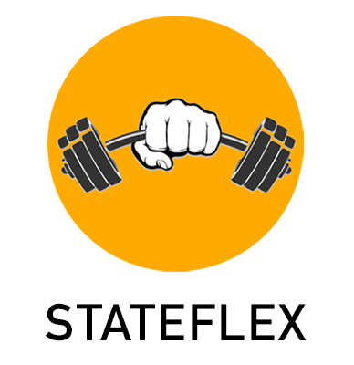

## THE PROBLEM

React, as its name implies, seamlessly reflects changes in state. However, as state management frameworks continue to evolve, there currently is no React prototyping application that allows the user the flexibility to choose the state management tool that is most appropriate for their application's scale and needs.

## THE SOLUTION

**StateFlex** is a visual prototyping tool for developers utilizing **React** as their front-end architechture. The application provides the user the ability to implement either **React** as a means to manage state, or incorporate **Redux** when the needs of the project require it, all of which are written in **TypeScript** safe code.\
This means **StateFlex** will generate **React/Redux** code in a **TypeScript** environment as a launching pad for your application. 

At the heart of **StateFlex** is the _component visualization tree_ which provides the user a _real-time_ reflection of their application hierarchy. As the user engages with the GUI and builds their component tree and selects their preferences, the code is dynamically displayed in the _code preview_. _Reducers_, _Interfaces_, _React Hooks_ and more are all features **StateFlex** offers for this highly _customizable_ prototyping tool and experience. 


## Getting Started:

By default, **StateFlex** will begin in React mode. To add Redux, you can click the blue button on the lower left part of the screen, but we'll get into that more later. 

#### Adding and Deleting React Components:


#### Connecting and Disconnecting React Components:


#### Add or Delete HTML elements:


#### Creating Local State:


#### Creating TypeScript Interfaces:


#### Switching Project Type:


#### Adding Reducers for the Redux Store:


#### Connecting Reducers to the Application:


#### Exporting Application File:


#### Clearing Project:


## Running Your Own Version

- **Fork** and **Clone** repository.
- open project directory
- install dependencies

```bash
npm install
```

- run application

```bash
npm start
```

- for development experience

```bash
npm run dev
```

## License

This project is licensed under the MIT License
